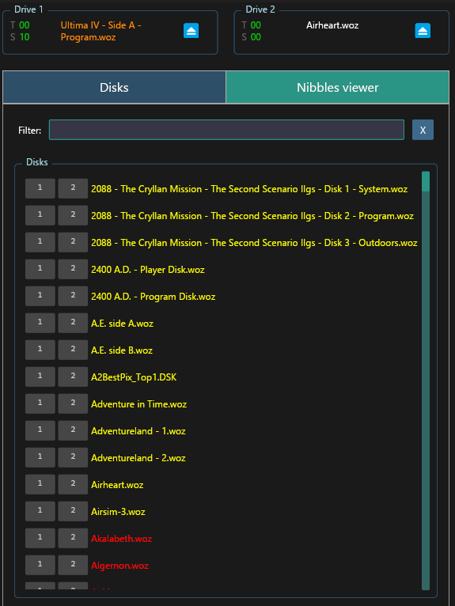

<p align="center">
  
</p>

<p align="center">
  <h1 align="center">
    An Apple // emulator in Rust
  </h1>
</p>


<p align="center">
  
</p>

# Introduction

Maple // is an Apple ][ emulator written in Rust. It was initially inspired by [my Kotlin Apple \]\[ emulator](https://github.com/cbeust/sixty) but
diverged quite a bit after a while and by now, it supports a lot of additional features (double hi resolution, write, etc...).

Maple // has a specific focus on being developer friendly by exposing a lot of internal details on the emulation, e.g.

- A convenient file picker view that lets you quickly insert disks in the drives of your choice
- A Nibble view that shows you the raw nibbles contained on the current track
- A track map showing you which tracks are standard (green dot) and non standard (yellow dot)
- A disk view, so you can visualize the head as it moves across the disk
- A debugger (very much a work in progress)

## Building and running

```
$ cd apple2
$ cargo run -r
```

## Documentation

When you launch `Maple //` for the first time, you will have to select a folder that contains Apple ][ disk images
(.woz and .dsk). This directory will be read recursively. After this, select the disks of your choice, place them in
the drive 1 or 2, and press the `Reboot` button.

### Views

#### Disks

Once you have selected a directory, all the disks found in that directory and below will be displayed in that window.
Just press "Drive 1" or "Drive 2" to insert that disk in the drive. You can use the filtering box on the side
to narrow down the disk you're looking for.

#### Memory

This view presents the memory along with various convenient shortcuts to memory banks (e.g. Text, Text Aux, ...).

#### Nibbles

This view shows you what was found on the disk. It's made of two parts:

- At the top, the map of all the tracks (quarter tracks really) shown either in green (standard track) or yellow
  (non-standard track, most likely protected). A "." indicates an empty track (will return random bits). You
  can click on any of these tracks to take a look at its nibbles
- Below is the actual buffer of bits, corrected to show you nibbles. `Maple //` will attempt to locate the
  markers for address and data in order to facilitate identifying where these tracks start. This will only
  produce highlighted results for standard markers (`D5 AA 96` / `DE AA` and `D5 AA AD`/`DE AA`).

### Floppy disk

This view shows you where the track is at it moves across the disk.

## Tests

`cargo test` will run [Klaus' functional suite for the 6502](https://github.com/Klaus2m5/6502_65C02_functional_tests), which guarantees that the emulation is "mostly"
correct. Additionally, my Kotlin emulator boots a few Apple ][ games that use precise cycle timing for their protection,
so I'm reasonably confident the cycle counting is correct as well, including the handling of page crossing and
"branch taken", but there are no tests for cycle counting.

This code is pretty rigid right now, it needs to add some kind of listener support for the memory reads and
writes in order to be usable in an emulator, but this should be pretty trivial to add.
  
## Harte's processor tests

The `harte/` directory contains a TUI runner for Tom Harte's 6502 tests:

```
cd harte
cargo run --release
```


<p align="center">
  
</p>

## Developer note

I made the graphical back-end as agnostic as I could since there are so many Rust crates that let you display
pixels on the screen, and as a proof of concept, I experimented with two different graphical backends: `egui` (which
is the current `Maple //` GUI/graphics library) and `minifb`). Here is what the experiment looks like:

https://github.com/cbeust/sixty.rs/assets/92322/499b9f47-600c-4ce7-85b7-c373e18b427e

## Gallery
<table>
    <tr>
        <td></td>
        <td></td>
    </tr>
    <tr align="center">
        <td><b>Text (40 columns)</b></td>
        <td><b>Text (80 columns)</b></td>
    </tr>
    <tr>
        <td></td>
        <td></td>
    </tr>
    <tr align="center">
        <td><b>King's Quest (DHGR)</b></td>
        <td><b>Airheart (DHGR)</b></td>
    </tr>
    <tr>
        <td></td>
        <td></td>
    </tr>
    <tr align="center">
        <td><b>Disks view</b></td>
        <td><b>Memory view</b></td>
    </tr>
    <tr>
        <td></td>
        <td></td>
    </tr>
    <tr align="center">
        <td><b>Nibbles view</b></td>
        <td><b>Floppy Disk view</b></td>
    </tr>
    <tr>
        <td></td>
        <td></td>
    </tr>
    <tr align="center">
        <td><b>Aztec</b></td>
        <td><b>Apple Galaxian</b></td>
    </tr>
    <tr>
        <td></td>
        <td></td>
    </tr>
    <tr align="center">
        <td><b>The Black Cauldron</b></td>
        <td><b>Bouncing Kamungas</b></td>
    </tr>
    <tr>
        <td></td>
        <td></td>
    </tr>
    <tr align="center">
        <td><b>Conan</b></td>
        <td><b>Ultima V</b></td>
    </tr>
</table>
